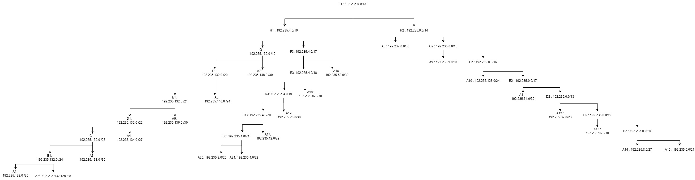
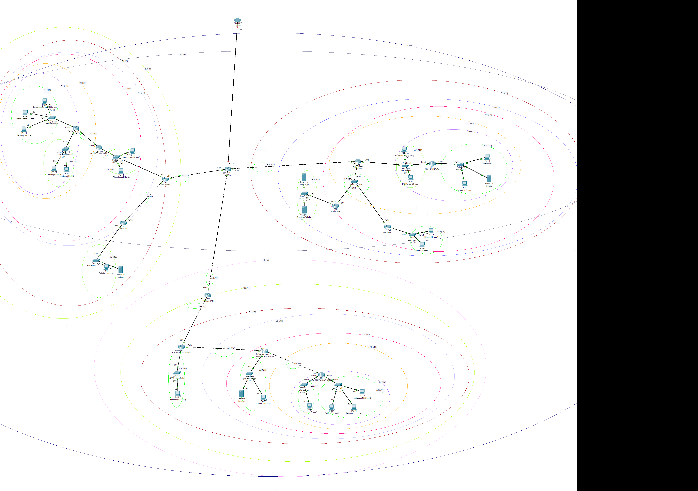

| Nama    | NRP     | 
| ------- | ------- | 
| Imam Nurhadi    | 5027221046     | 
| Jojo     | 5027221062     |

## Cisco Packet Tracker
Dalam pengerjaan modul 4 ini, kami di berikan case untuk membuat topologi sebagai berikut 

Dalam topologi tersebut, dilakukan Classing untuk menentukan setiap subnetnya!
Berikut merupakan step pengerjaan kami untuk Classing subnet

## Pembagian Prefix dan IP
###Pembagian Prefix
#### Identifikasi Kebutuhan Jaringan
1. **Tentukan jumlah host yang diperlukan dalam setiap subnet.**
2. **Ketahui jumlah total subnet yang dibutuhkan.**

#### Menghitung Ukuran Subnet
Gunakan formula berikut untuk menentukan ukuran subnet:

\[ 2^n - 2  >= {jumlah host} \]

dimana \( n \) adalah jumlah bit yang dialokasikan untuk host.

**Contoh:**
Jika kamu membutuhkan 50 host, maka:

\[ 2^6 - 2 = 62 \]

Jadi, kamu membutuhkan 6 bit untuk host.

#### Menentukan Prefix

Subnet mask memiliki total 32-bit. Jadi, jika 6 bit dialokasikan untuk host, maka:

\[ 32 - 6 = 26 \]

Prefix akan menjadi /26.

###Pembagian IP
Hasil pembagian IP dan prefix kami sebagai berikut :

Pembagian ip lakukan dengan tahap :
1. Layer Terluar merupan hierarki tertinggi.
2. Lalu akan dibagi 2 cabang yaitu wilayah kanan kiri dan wilayah bawah, atau bisa disebut H1 dan H2. Ip ditentukan dengan ip address pada subnet dibagi dengan yang lebih rendah. Disini /14 dibagi dengan /16 hasilnya yaitu 26144/65536 dan hasilnya adalah 4. Maka hasil tersebut ditaruh pada bit ke 3 ip dengan subnet lebih kecil yaitu /16.
3. Selanjutnya kita bisa lihat lagi untuk subnet lebih tinggi akan dibagi 256, untuk hasilnya 32768/256 = 128 maka kita taruh ke bit 4 dari ip dengan subnet lebih rendah, jika masih cukup (batas maksimalnya /19 bit ke 4 adalah 255) maka kita taruh ke bit 4, jika tidak cukup sisanya ditaruh ke bit 3. Namun karena turunannya bit ke
4. Namun untuk ip dengan prefix /25 dan /28 kita bisa langsung taruh 128 ke ip prefix /28 karena tidak bisa dibagi 256 dan masih cukup untuk bit ke 4 dari /28 

A. Penggabungan dengan metoded CIDR dan hasil pembagian prefix dan subnetting
1. Setiap wilayah dan jalur router memiliki A Class masing-masing dengan subnet yang cukup untuk dibagi IP nya terhadap beberapa host dan device.
2. Topologi dibagi 3 wilayah besar, yaitu kiri, tengah, dan kanan. DImana Sumatera merupakan wilayan kiri, kalimantan wilayah tengah, dan sulawesi wilayah kanan. JAWA? **JAWAAA ADALAH KUNCI**
3. Setelagh Class A sudah dibagi, setiap wilayah akan memiliki tahap penggabungan. 2 Class A akan digabung mejadi satu dengan syarat berdekatan dan mejadi CLass baru yaitu Class B.
4. Setelah setiap wilayah memiliki 1 Class B masing masing, maka akan dilakukan penggabungan lagi yaitu pada Class B setiap wilayah akan digabungkan dengan Class A terdekatnya.

Seperti inilah hasil penggabungan kami
## Penggabungan

### Tabel Subnet B
| Subnet | Gabungan dari  |         |        |                |Netmask Akhir |
|--------|----------------|---------|--------|----------------|--------------|
|        | 1              |         |2       |                |              |
|        | Subnet         | Netmask | Subnet | Netmask        |              |
| B1     | A1             | /25     | A2     | /28            | /24          |
| B2     | A14            | /27     | A15    | /21            | /20          |
| B3     | A20            | /26     | A21    | /22            | /21          |

### Tabel Subnet C
| Subnet | Gabungan dari |          |        |                | Netmask Akhir |
|--------|----------------|---------|--------|----------------|----------------|
|        | 1              |         | 2      |                |                |
|        | Subnet         | Netmask | Subnet | Netmask        |                |
| C1     | B1             | /24     | A3     | /30            | /23            |
| C2     | B2             | /20     | A13    | /30            | /19            |
| C3     | B3             | /21     | A17    | /30            | /20            |

### Tabel Subnet D
| Subnet | Gabungan dari  |         |        |                | Netmask Akhir  |
|--------|----------------|---------|--------|----------------|----------------|
|        | 1              |         | 2      |                |                |
|        | Subnet         | Netmask | Subnet | Netmask        |                |
| D1     | C1             | /23     | A4     | /27            | /22            |
| D2     | C2             | /19     | A12    | /23            | /18            |
| D3     | C3             | /20     | A19    | /26            | /19            |

### Tabel Subnet E
| Subnet | Gabungan dari |          |        |                | Netmask Akhir  |
|--------|----------------|---------|--------|----------------|----------------|
|        | 1              |         | 2      |                |                |
|        | Subnet         | Netmask | Subnet | Netmask        |                |
| E1     | D1             | /22     | A5     | /30            | /21            |
| E2     | D2             | /18     | A11    | /30            | /17            |
| E3     | D3             | /19     | A18    | /30            | /18            |

### Tabel Subnet F
| Subnet | Gabungan dari  |         |        |                | Netmask Akhir | 
|--------|----------------|---------|--------|----------------|----------------|
|        | 1              |         | 2      |                |                |
|        | Subnet         | Netmask | Subnet | Netmask        |                |
| F1     | E1             | /21     | A6     | /24            | /20            |
| F2     | E2             | /17     | A10    | /24            | /16            |
| F3     | E3             | /18     | A16    | /30            | /17            |

### Tabel Subnet G
| Subnet | Gabungan dari  |         |        |                | Netmask Akhir  |
|--------|----------------|---------|--------|----------------|----------------|
|        | 1              |         | 2      |                |                |
|        | Subnet         | Netmask | Subnet | Netmask        |                |
| G1     | F1             | /20     | A7     | /30            | /19            |
| G2     | F2             | /16     | A9     | /30            | /15            |

### Tabel Subnet H
| Subnet | Gabungan dari  |         |        |                | Netmask Akhir  |
|--------|----------------|---------|--------|----------------|----------------|
|        | 1              |         | 2      |                |                |
|        | Subnet         | Netmask | Subnet | Netmask        |                |
| H1     | G1             | /19     | F3     | /17            | /16            |
| H2     | G2             | /15     | A8     | /30            | /14            |

### Tabel Subnet I
| Subnet | Gabungan dari  |         |        |                | Netmask Akhir  |
|--------|----------------|---------|--------|----------------|----------------|
|        | 1              |         | 2      |                |                |
|        | Subnet         | Netmask | Subnet | Netmask        |                |
| I1     | H1             | /16     | H2     | /14            | /13            |

### Hasil CPT
Maka hasil cpt akan sebagai berikut 

